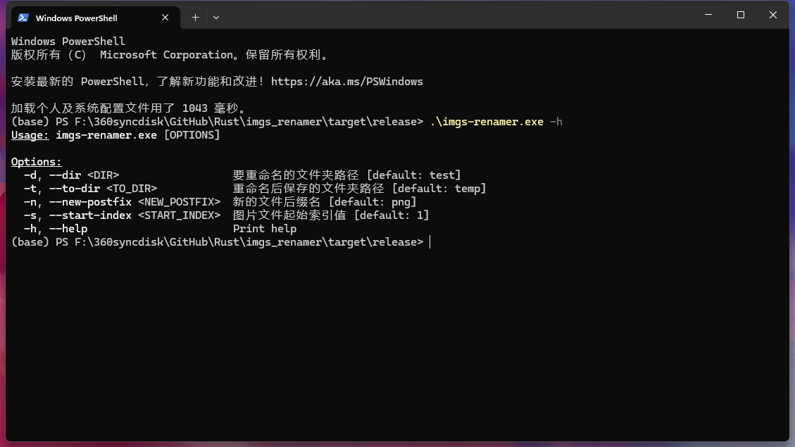

# imgs-renamer

`imgs-renamer` 是一个用于重命名图像文件的工具，它可以帮助你批量地将图像文件重命名为更有意义的名称。

<div style="text-align: center;">
    
    
</div>


## 特性

- [x] 批量重命名图像文件。
- [x] 支持多种图像格式，例如 JPG, PNG, WEBP 等。
- [x] 简单易用的命令行界面。
- [ ] 提供可定制的命名模式。


## 开始使用

### 安装

你可以通过克隆项目到本地来安装 `imgs-renamer`：

```bash
git clone https://github.com/YenHarvey/imgs-renamer.git
cd imgs-renamer
```

### 使用方法

使用 `imgs-renamer` 很简单，只需要运行以下命令：

```bash
cargo build --release
./target/release/imgs-renamer -d <目录>
```

其中 `<目录>` 应该替换为你的图像文件所在的目录。

可用的选项包括：
```bash
Options:
-d, --dir <DIR>                  要重命名的文件夹路径 [default: test]
-t, --to-dir <TO_DIR>            重命名后保存的文件夹路径 [default: temp]
-n, --new-postfix <NEW_POSTFIX>  新的文件后缀名 [default: png]
-s, --start-index <START_INDEX>  图片文件起始索引值 [default: 1]
-h, --help                       Print help
```

### 示例

~~假设你有一系列图像文件，你想将它们重命名为 `holiday-001.jpg`，`holiday-002.jpg` 等，你可以这样做：~~

假设你有一系列图像文件，你想将它们批量重命名，你可以这样做：

```bash
./target/release/imgs-renamer -d /path/to/your/images -t /path/to/save/rename/images -n jpg -s 1
```


## 许可证

`imgs-renamer` 采用 BY-NC-SA 4.0 许可证。详情请见 [LICENSE](LICENSE) 文件。
